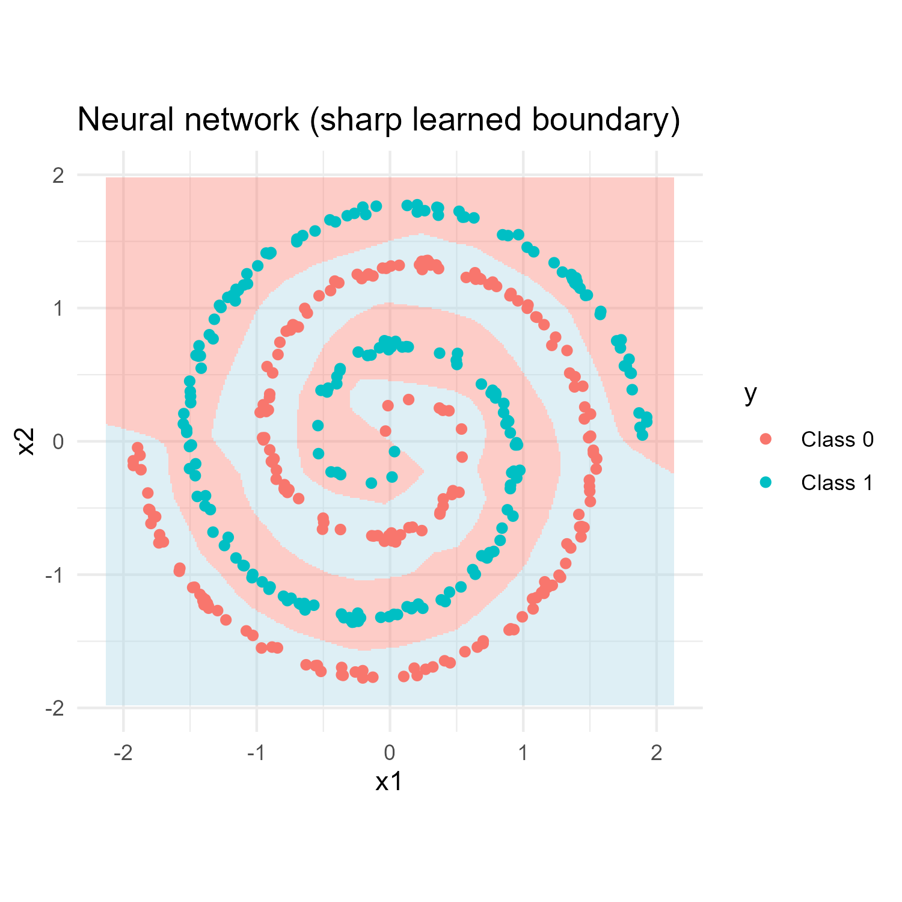
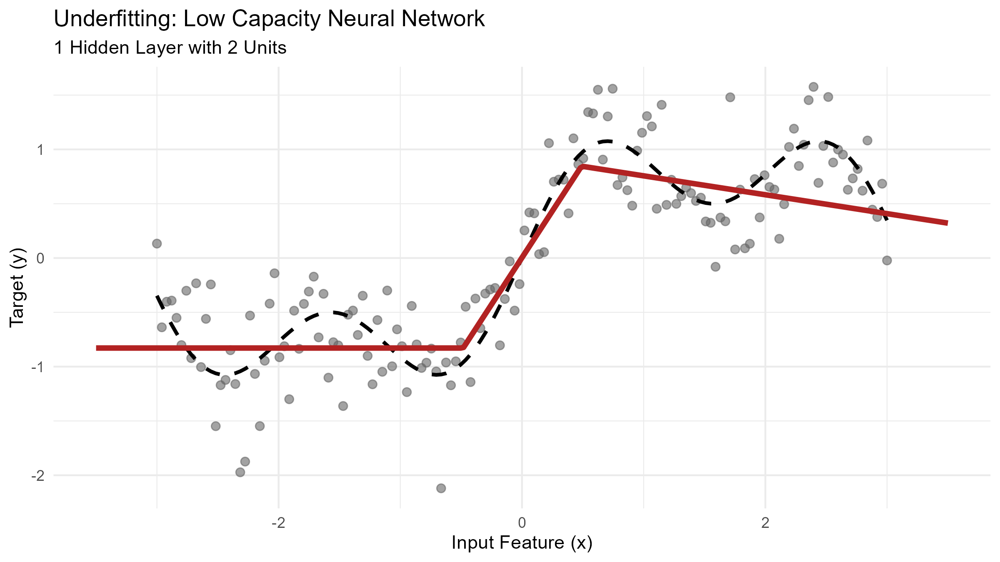
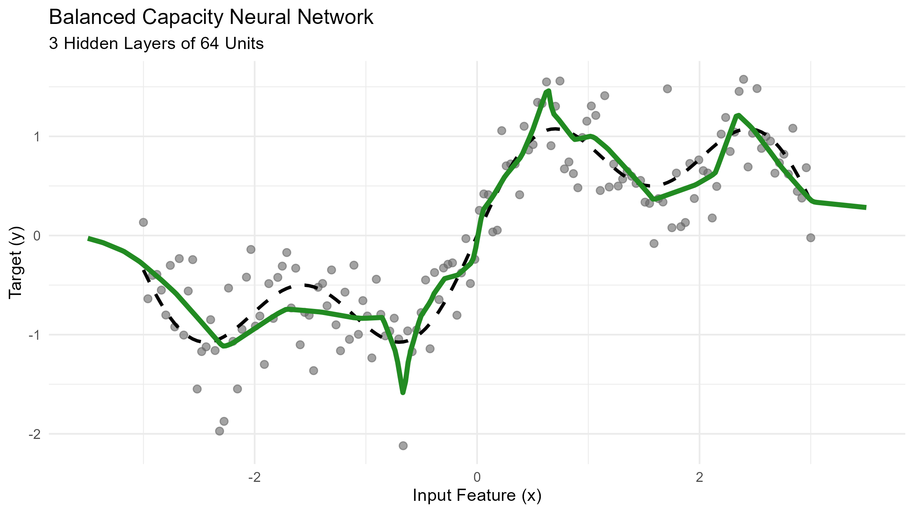
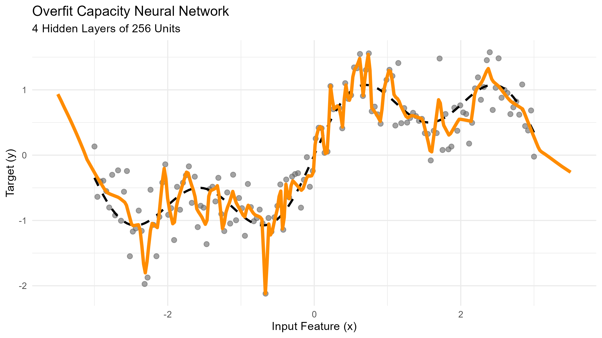

```{r}
# imports functions from utils.R where we have a function that builds NN
#| include: false
source("utils.R")
```


## Demystifying Neural Networks {.smaller}

::: {.fragment}
A Neural Network is simply **another class of mathematical functions** used for regression and classification.
:::

::: {.fragment}
In previous presentations we considered *linear functions* and *polynomial functions*. Here, we repeat a simple recipe: **composing linear maps with non-linear maps** to build more expressive functions.
:::

::: {.columns}

::: {.column width="65%"}

::: {.fragment}
### The Intuition {.smaller}
::: 
::: {.incremental}
* **It’s just composition of functions:** We are nesting simple functions inside one another: $f(g(h(x)))$.
* **Nothing changes about our goals:** We still use features $X$ to predict targets $y$.
* We still calculate a **Loss Function** to see how wrong we are.
* We still use an optimizer to minimize that loss.
:::
:::


::: {.column width="35%"}
::: {.fragment}
```{r}
#| echo: false
#| fig-width: 5
#| fig-height: 4
# Visualizing a network with 2 inputs, a 3-node hidden layer, and 1 output
plot_nn_quick(c(2, 3, 3, 1), bias = TRUE, label_size = 1.2)

```

:::
:::
:::


## From Linear Models to Neural Networks {.smaller}

To build a neural network we stack linear maps with non-linear activations. 

::: {.panel-tabset .smaller style="font-size: 90%;"}

### 1. Linear (Base) {.smaller}
- To build a network we start with standard linear maps—technically **affine transformations** because they include both weights ($W$) and a bias ($b$).
- These combinations hold all the adjustable parameters our network needs to learn. 
- However, a linear combination of linear combinations remains strictly linear; on their own, no matter how many we stack, they cannot capture complex non-linear relationships.


::: {.columns}

::: {.column width="50%"}
```{r}
plot_nn_quick(c(4, 1), bias = TRUE, label_size = 1.2)
```
:::

::: {.column width="50%"}
```{r}
plot_nn_quick(c(4, 3), bias = TRUE, label_size = 1.2)
```
:::
:::


### 2. Non-Linear Activation {.smaller }

To break linearity and allow networks to learn complex shapes, **every linear map is followed by a non-linear activation function**. Two of the common ones are ReLU and Sigmoid, which appeared in binary classification problems. 

---

::: {.columns}

::: {.column width="50%"}
#### ReLU (Rectified Linear Unit)
$$f(x) = \max(0, x)$$

```{r}
#| echo: false
#| fig-width: 4
#| fig-height: 2.5
curve(pmax(0, x), from = -4, to = 4, col = "steelblue", lwd = 2.5, 
      ylab = "f(x)", xlab = "Input (x)", main = "ReLU Activation")
grid()

```

:::

::: {.column width="50%"}
#### Sigmoid

$$\sigma(x) = \frac{1}{1 + e^{-x}}$$

```{r}
#| echo: false
#| fig-width: 4
#| fig-height: 2.5
curve(1 / (1 + exp(-x)), from = -4, to = 4, col = "firebrick", lwd = 2.5, 
      ylab = "σ(x)", xlab = "Input (x)", main = "Sigmoid Activation")
grid()

```

:::
:::
--- 

Beyond these two, there are many other options available, such as **tanh**, **LeakyReLU**, or **Softmax**, but they all serve the same purpose.


### 3. Neural Network {.smaller}


By stacking linear maps followed by non-linear activations, the network can "learn" **any continuous mathematical function**.


::: {.columns .smaller}

::: {.column width="50%"}

* **The Input Layer:** The first layer, consists of our raw data features $X$.
* **The Hidden Layers:** The intermediate layers are called "hidden" simply because their outputs are not directly observed in the training data.
* **The Output Layer:** The final layer, which produces our final predictions $\hat{y}$ for regression or classification.
:::

::: {.column width="50%"}
```{r}
#| echo: false
#| fig-width: 5
#| fig-height: 4
plot_nn_quick(c(2, 3, 3, 1), bias = TRUE, label_size = 1.2)
```
:::
:::

### 4. NN in R

::: {.columns}
::: {.column width="40%"}

Consider the NN model with:

- input: two units
- 2 hidden layers of 3 units each
- output: 1 unit  

```{r}
#| echo: false
#| fig-width: 5
#| fig-height: 4
plot_nn_quick(c(2, 3, 3, 1), bias = TRUE, label_size = 1.2)
```

:::
::: {.column width="60%"}

- To build it in R we use `keras_model_sequenctial`. 
  
- If we use it for classification, we end with Sigmoid

::: {style="font-size: 120%;"}
```{r}
#| echo: true
#| eval: false
model_nn <- keras_model_sequential() |>
  layer_dense(units = 3, activation = "relu", input_shape = 2) |>
  layer_dense(units = 3, activation = "relu") |>
  layer_dense(units = 1, activation = "sigmoid")
```
:::


- If we use it for regression, we end with the unit.

::: {style="font-size: 120%;"}
```{r}
#| echo: true
#| eval: false
model_nn <- keras_model_sequential() |>
  layer_dense(units = 3, activation = "relu", input_shape = 2) |>
  layer_dense(units = 3, activation = "relu") |>
  layer_dense(units = 1)
```
:::

:::
:::

:::


## Classification {.smaller}

::: {.columns style="font-size: 75%;"}
::: {.column width="60%"}

- Recall that in classification problems we observe data $\{(\mathbf{x}_i,y_i):i\leq N\}$ where $\mathbf{x}_i\in\mathbb{R}^n$ and $y_i\in\{0,1\}$ is the label.
- We model the probability using $f_\theta:\mathbb{R}^n\to [0,1]$ where $f_\theta(\mathbf{x})$ estimates the probabilty that the label of $x$ is 1. 
- We choose $\theta^*$ that maximizes the probability of observing our data (Maximum Likelihood Estimate)
- Which is equivalent to minimazing the **Binary Cross-Entropy**
$$\text{Loss}(\theta) = -\frac{1}{N}\sum_{i=1}^N\left[ y_i\log(f_\theta(\mathbf{x}_i))+(1-y_i)\log(1-f_\theta(\mathbf{x}_i))\right]$$

:::

::: {.column width="40%"}

```{r}
#| echo: false
#| fig-width: 5
#| fig-height: 4
library(ggplot2)

pi <- base::pi
set.seed(123)
n_samples <- 200
noise <- 0.5

# 1. Generate core spiral data (Class 0)
n <- sqrt(runif(n_samples)) * (360 + 360) * (2 * pi) / 360
d1x <- -cos(n) * n + runif(n_samples) * noise
d1y <- sin(n) * n + runif(n_samples) * noise

# 2. Replicate vstack/hstack to combine and invert for Class 1
x_raw <- c(d1x, -d1x)
y_raw <- c(d1y, -d1y)

# 3. Build data frame and apply scaling (StandardScaler equivalent)
df <- data.frame(
  x1 = drop(scale(x_raw)),
  x2 = drop(scale(y_raw)),
  y = factor(rep(c("Class 0", "Class 1"), each = n_samples))
)

# 4. Final Plot
ggplot(df, aes(x = x1, y = x2, color = y)) +
  geom_point(size = 1.5) +
  scale_color_manual(values = c("Class 0" = "red", "Class 1" = "blue")) +
  labs(title = "Interlocking Spiral Data", x = "Feature 1", y = "Feature 2") +
  theme_minimal() +
  theme(
    panel.background = element_rect(fill = "#EAEAF2", color = NA),
    panel.grid.major = element_line(color = "white"),
    panel.grid.minor = element_line(color = "white", size = 0.2),
    aspect.ratio = 6/7
  )

```
:::

:::

::: {.fragment}
#### Look at the Double Spiral Example {.smaller }
:::

::: {.incremental style="font-size: 80%;"}

- The data cannot be separated linearly. 
- Logistic regression is linear; therefore, it cannot do a good job.
- However, we will see that a small Neural Network model will separate the data properly.
:::

## Logistic Regression Classification of Double Spiral Data {.smaller style="font-size: 60%;"}

::: {.columns}
::: {.column width="50%"}

- Our data is included in the data frame **df** that has columns **x1, x2** and the label **y**. 

- In R, to find the logistic model we use the generalized linear model function (gml) using a binomial family: 
```{r}
#| eval: false
#| echo: true
fit_logit <- glm(y ~ x1 + x2, family = binomial(), data = df)
```

- Then we use the the logistic model to predict values in a grid in $[-2,2]\times[-2,2]$ and we color them according to the levels.

- The boundary is clearly linear

:::
::: {.column width=50%}

```{r}
#| fig-width: 5
#| fig-height: 4
# 1. Fit the Logistic Regression Model
fit_logit <- glm(y ~ x1 + x2, family = binomial(), data = df)

# 2. Generate the grid and predict binary probabilities
grid <- make_grid(df)
grid_mat <- as.matrix(grid[, c("x1", "x2")])
raw_probs <- as.numeric(predict(fit_logit, newdata = as.data.frame(grid_mat), type = "response"))
grid$prob <- ifelse(raw_probs >= 0.5, 1, 0)

# 3. Generate the plot object using your function
p <- plot_boundary(grid, df, "Logistic regression (sharp linear boundary)")

# 4. OVERRIDE THE LEGEND: Turn off the continuous fill guide and display the plot
p + guides(fill = "none")
```
:::
:::

::: {.fragment}
- This model has only three parameters: 2 weights $w_1$, $w_2$ and a bias term $b$


:::

## Neural Network Model {.smaller style="font-size: 60%;"}

::: {.columns}
::: {.column width="40%"}
- We choose a model with 2 hidden layers
- Each hidden layer has 32 neurons and it is followed by a ReLU activation function
- We end with Sigmoid because we are doing binary classification
:::
::: {.column width="60%"}
In R this model is defined by
```{r}
#| eval: false
#| echo: true

model_nn <- keras_model_sequential() |>
  layer_dense(units = 32, activation = "relu", input_shape = 2) |>
  layer_dense(units = 32, activation = "relu") |>
  layer_dense(units = 1, activation = "sigmoid")
```

- The model has 1,185 trainable parameters! 
::: 
::: 

::: {.fragment}
A NN model with 2 hidden layers of 12 neurons looks like this (our model has 32 units instead of 12):

```{r}
#| fig-width: 15
#| fig-height: 5
plot_nn_quick(c(2, 12, 12, 1), bias = TRUE, label_size = 0.5)
```
:::


## Neural Network Decision Boundary {.smaller style="font-size: 60%;"}


::: {.columns}
::: {.column width="50%"}
- In R it is easy to train the NN models. 
- We select the optimizer and the loss function, which matches what we discussed
- We use the fit function, passing the data and the number of iterations to find the solution

```{r}
#| echo: true
#| eval: false
model_nn |>
  compile(
    optimizer = optimizer_adam(learning_rate = 0.01),
    loss = "binary_crossentropy"
  )

model_nn |>
  fit(
    x, y_num,
    epochs = 100,
    batch_size = 32,
    verbose = 0
  )

```
:::

::: {.column width="50%"}

- Once we have the model we predict the values on a grid of the rectangle $[-2,2]\times[-2,2]$

{fig-align="center" }
:::
:::

::: {.fragment}
- As you can see, the model separates the data perfectly.
- However, when we use models this powerful, we must immediately worry about **overfitting**.
:::


## Regression {.smaller}


::: {.incremental}


* Recall that in regression, we observe data $\{(\mathbf{x}_i,y_i):i\leq N\}$ where $\mathbf{x}_i\in\mathbb{R}^n$ and $y_i\in\mathbb{R}$
* We model the relationship using $f_\theta:\mathbb{R}^n\to\mathbb{R}$ to predict: $\hat{y}_i = f_\theta(\mathbf{x}_i)$
* We measure overall fit using the Mean Square Error (MSE) loss function: 
  $$\text{Loss}(\theta) =\frac{1}{N}\sum_{i=1}^N(y_i-\hat{y}_i)^2$$
* Goal: find $\theta^*$ that balances minimizing training error with generalizing to unseen data (avoiding overfitting)
* In this presentation we will use neural networks to represent a non-linear function
:::


## The Data {.smaller}

We will use different neural network models to fit a complex oscillating signal created by a sum of sine waves: $y = \sin(x) + 0.5\sin(3x) + \epsilon$. 

```{r}
#| echo: false
#| fig-width: 8
#| fig-height: 4.5
#| fig-align: center
#| dev: "svg"
library(ggplot2)

sine_data <- generate_sine_data()
df_reg <- sine_data$df

ggplot(df_reg) +
  geom_point(aes(x = x, y = y), color = "gray40", alpha = 0.6, size = 2) +
  geom_line(aes(x = x, y = true_signal), color = "black", linewidth = 1.2, linetype = "dashed") +
  theme_minimal() +
  labs(title = "True Signal vs. Noisy Training Samples", x = "x", y = "y")

```

## Low Capacity Model (Underfitting) {.smaller}

Here we use a simple model with **7 paramaters**: 1 hidden layer with 2 units

::: {.panel-tabset .smaller }
### 1. Predicted Model 
{fig-align="center" width="80%"}

 

### 2. Model and Training 

```{r}
#| echo: true
#| eval: false
# 1. Define the Low Capacity Model (Underfitting)
model_low <- keras_model_sequential() |>
  layer_dense(units = 2, activation = "relu", input_shape = 1) |>
  layer_dense(units = 1) # Linear identity output for regression

# 2. Compile with Mean Squared Error (MSE) loss
model_low |> compile(
  optimizer = optimizer_adam(learning_rate = 0.02),
  loss = "mse"
)

# 3. Train the model
model_low |> fit(
  x = as.matrix(df_reg$x), 
  y = df_reg$y, 
  epochs = 500, 
  batch_size = 16, 
  verbose = 0
)

```

::: 

## Balanced Capacity Model {.smaller}

Here we use a balanced model with **8,513 paramaters**: 3 hidden layers with 64 units each

::: {.panel-tabset .smaller }
### 1. Predicted Model 
{fig-align="center" width="80%"}


 

### 2. Model and Training 

```{r}
#| echo: true
#| eval: false
# 1. Define the Model (Balanced)
model_bal <- keras_model_sequential() |>
  layer_dense(units = 64, activation = "relu", input_shape = 1) |>
  layer_dense(units = 64, activation = "relu") |>
  layer_dense(units = 64, activation = "relu") |>  # add a 3rd layer
  layer_dense(units = 1)

# 2. Compile with Mean Squared Error (MSE) loss
model_bal |> compile(
  optimizer = optimizer_adam(learning_rate = 0.003),
  loss = "mse"
)

# 3. Train the model
model_bal |> fit(
  x = as.matrix(df_reg$x), 
  y = df_reg$y, 
  epochs = 500, 
  batch_size = 32, 
  verbose = 0       # Set to 1 so you can see the training bars in RStudio!
)
```

::: 


## High Capacity Model (Overfitting){.smaller}

Here we use a high capacity model with **198,145 paramaters**: 4 hidden layers with 256 units each

::: {.panel-tabset .smaller }
### 1. Predicted Model 
{fig-align="center" width="80%"}


 

### 2. Model and Training 

```{r}
#| echo: true
#| eval: false
# 1. Define the Model (Overfit)
model_overfit <- keras_model_sequential() |>
  layer_dense(units = 256, activation = "relu", input_shape = 1) |>
  layer_dense(units = 256, activation = "relu") |>
  layer_dense(units = 256, activation = "relu") |>
  layer_dense(units = 256, activation = "relu") |>
  layer_dense(units = 1)

# 2. Compile with Mean Squared Error (MSE) loss
model_overfit |> compile(
  optimizer = optimizer_adam(learning_rate = 0.001),
  loss = "mse"
)

# 3. Train the model
model_overfit |> fit(
  x = as.matrix(df_reg$x),
  y = df_reg$y,
  epochs = 4000,
  batch_size = 32,
  verbose = 0
)
```

::: 


